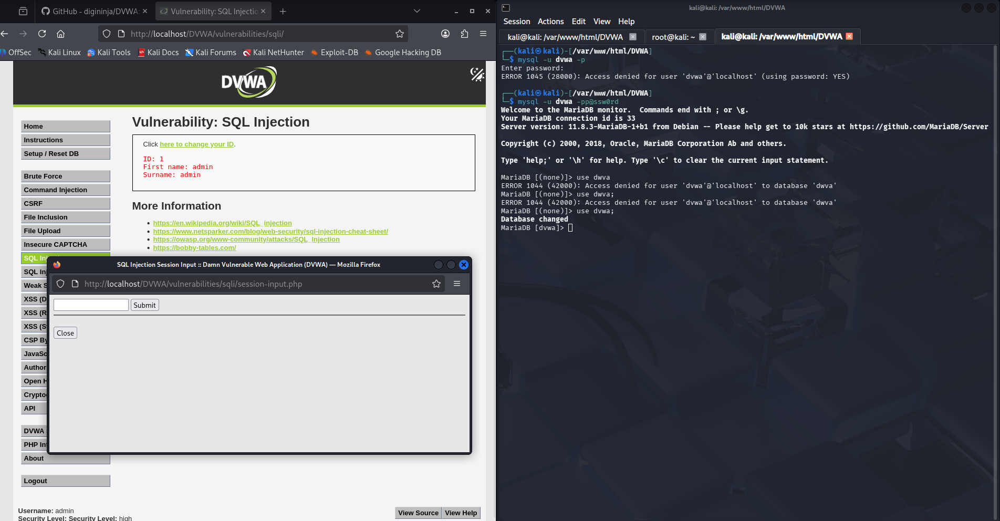
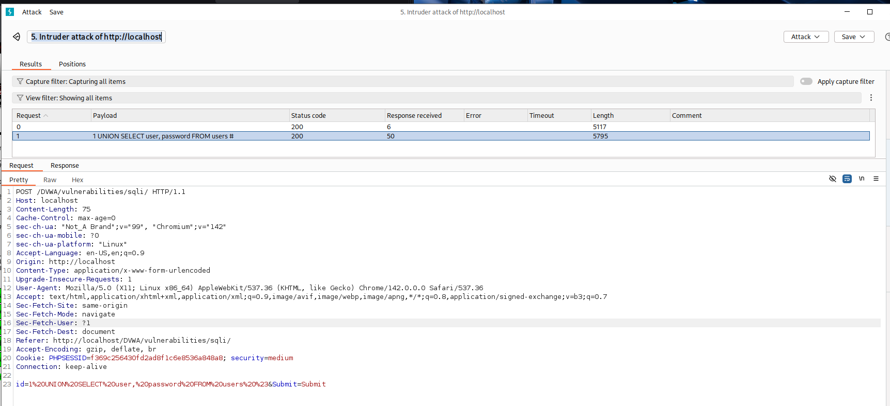
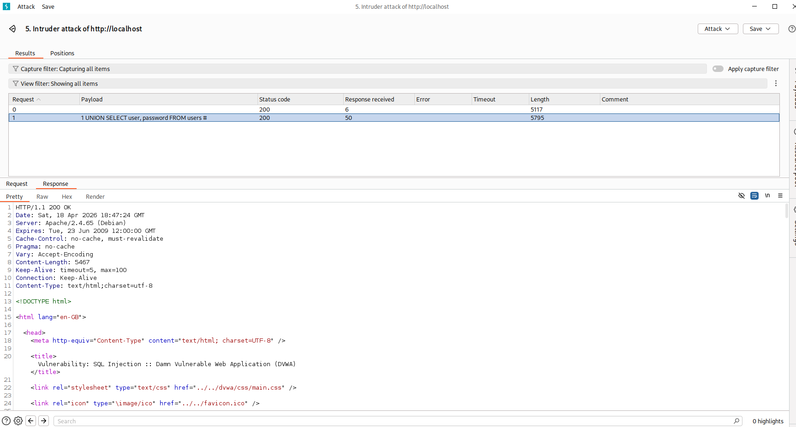
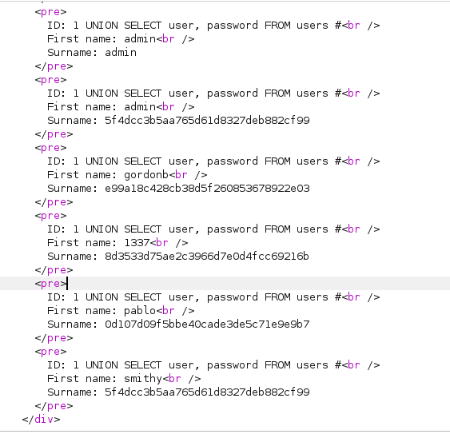
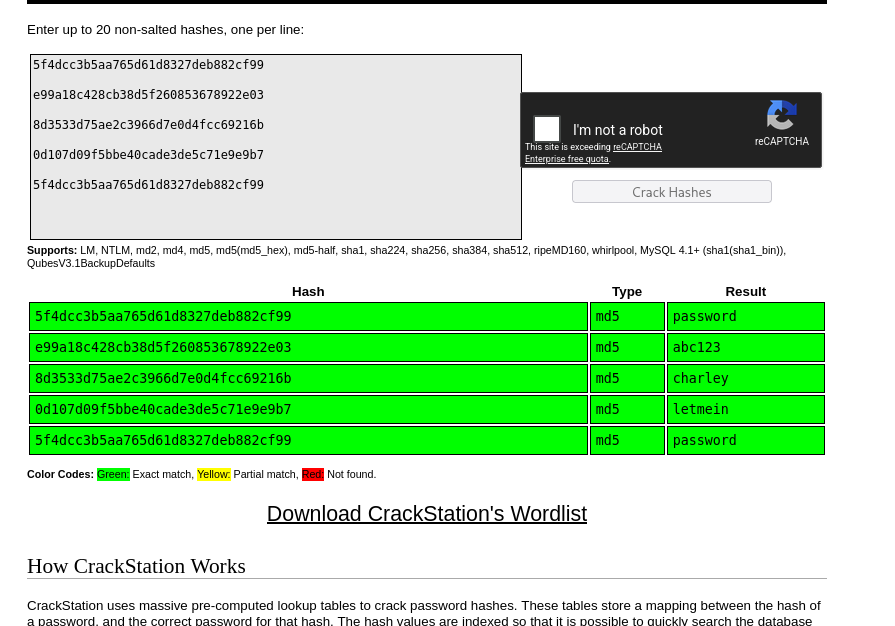

## Student Information
- Name: Krishna Chinta
- Email: kchinta1@umbc.edu

## Project Title
Web-Security-Lab

## Project Overview
This project simulates and exploits an SQL injection attack within an open-source public web application called DVWA. I used professional security tools to extract the passwords of all users in a database.

## Goal of this Project
The goal or purpose of this project is to demonstrate that a lack of proper input validation can expose critically sensitive information in an application that can harm all users of the application.

## Technologies Used
1. Kali Linux
2. The DVWA application
3. Apache web server
4. mySQL
5. BurpSuite
6. VirtualBox

## Key Features & Functionality
1. Response Interception (Using BurpSuite to capture the HTTP POST requests)
2. Payload Injection (injecting a malicious statement to cause the service to behave in an inappropriate manner)
3. Cracking Passwords

## My Role && Contribution
I was the sole contributor to this project. I set up the DVWA application, developed a bad payload, and used BurpSuite to inject a bad payload.

## More Details About The Project
This project hosts the DVWA application on an Apache Web Server. DVWA  is designed to be purposefully vulnerable to various injection attacks. I opened Burp Browser and went to the website (http://localhost/DVWA/security.php). I captured the particular request ‘POST /DVWA/vulnerabilities/sqli/’ that shows that I simply inputted ‘1’ in the text field. I sent this to the ‘Intruder’ feature of BurpSuite where I was able to insert many many possible payloads within the ‘text’ field at once and test all these payloads for a response.

## To Simply View the Findings
Open a linux terminal and clone the repo at https://github.com/Krishna43324/web-security-lab.git by using the command ‘git clone https://github.com/Krishna43324/web-security-lab.git’. Then, follow the steps mentioned in ‘View the Findings’

## View the Findings
1. Using File Manager, open the file named SQLInjectionEnvironment.png. There you can see the text field that accepts user input. I injected the SQL payload in this field. 

2. Next, open RequestPacket.png. In this screenshot, you can see the full spoofed request packet that I sent to the DVWA application hosted on the Apache web server on my VM. I replaced the character in the field ‘1’ with the payload ‘1 UNION SELECT user, password FROM users #’. The ‘1’ is the valid ID that the database is looking for. The remaining part of the payload is the SQL instruction we give to the database. Normally the database would take that ‘1’ and put SELECT firstname, lastname from users WHERE id=1. But now we use UNION to add a second argument/command. This second command selects the user and password fields from the users database. 

3. Next, open ResponsePacketBeginning.png to see the beginning of the response packet. You can open the file named ‘FullResponsePacket’ to see the full response packet. Open the ‘MD5HashesOnBurpSuite.png’ file to see the particular part of the response packet where I found the hashed passwords in the response packet. 

4. Next, open MD5HashesCracked.png where I used an online website to crack the hashes of all the passwords.

## To Setup and Replicate the Vulnerability
1. Follow the section ‘Setup and Installation’
2. Follow the section ‘Replicate the Vulnerability’

## Setup and Installation:
1. Install VirtualBox and set up a Kali Linux VM. Install the newest version of virtualbox and go to kali.org and search for the ‘Pre-built Virtual Machines’. You download the VM for virtualbox, extract that folder, double click the .vbox file, and use the default credentials (kali/kali). 
2. Either follow the Youtube video below or follow the below steps.
3. Type ‘git clone https://github.com/digininja/DVWA.git’ in the terminal
4. Type ‘sudo mv DVWA /var/www/html. Then, type ‘sudo service apache2 start’. Type ‘cp config/config.inc.php.dist config/config.inc.php’. Type ‘service mariadb start’. Type ‘sudo su -’ and type the password (kali). Type ‘mysql’ and type ‘create database dvwa;’. Then type ‘create user dvwa@localhost identified by 'p@ssw0rd';’. Type ‘grant all on dvwa.* to dvwa@localhost;’. Type ‘flush privileges;’. Then open a new terminal and type ‘mysql -u dvwa -pp@ssw0rd’. Type ‘use dvwa;’. 

## Replicate the Vulnerability
1. Open the BurpSuite application by clicking the blue button in the very top left and typing ‘Burp’ and opening the BurpSuite application. You will create a temporary project on disk with the default BurpSuite settings and it will load up the application. Click the ‘Proxy’ tab and click the button that says ‘Open Browser’ under the Intercept tab. Then type ‘http://localhost/DVWA/login.php’. Enter the credentials (admin/password). Open a new tab and type http://localhost/DVWA/security.php. Change the difficulty mode to ‘high’.  
‘http://localhost/DVWA/vulnerabilities/sqli/’. Then type ‘1’. 
6. Go back to the BurpSuite application (not the Burp Browser) and click the HTTP history tab. Find the POST /DVWA/vulnerabilities/sqli/ request and right click it and press ‘Send to Repeater’. I did it using Intruder to test a large number of payloads at once but it is easier to use Repeater. Then click the ‘Repeater’ tab. Scroll down to the field where it says ‘id=1&Submit=Submit’ and replace ‘1’ with ‘1 UNION SELECT user, password FROM users #’. Then click ‘Send’. Note: if you take a large break between Step 5 and 6, the cookies will expire and you will have to redo the steps.
7. Now you can view the ‘Response’. The first line should be HTTP/1.1 200 OK. Scroll down until you see what is shown in the ‘MD5HashesOnBurpSuite.png’ file. 

## Reflection
I learned that injection attacks can be deadly and expose user data. Applications that are not using proper input validation are very vulnerable to such attacks. 

## Sources
1. https://github.com/digininja/DVWA
2. https://www.youtube.com/watch?v=WkyDxNJkgQ4
3. https://www.kali.org/get-kali/#kali-virtual-machines
4. https://github.com/yogsec/SQL-Injection-Payloads/blob/main/Union_Based_SQLi_Payloads.txt
5. https://crackstation.net/

## Project Screenshots

